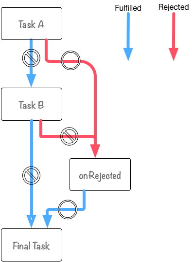

# Promise

## Promise.resolve():
> 本质：new Promise的语法糖，用于转换为promise

如果：
1. 参数是Promise对象，返回的还是接收到的Promise
3. 参数是其他类型时，返回一个值 ( resolve的参数 ) 为该参数的新的promise对象:
    ```js
    Promise.resolve(42);
    // 相当于
    new Promise(resolve=>{
        resolve(42)
    })
    ```
3. 参数是thenable类型对象，返回一个新的promise对象，
## Promise.reject():
返回一个执行了reject的promise对象
```js
Promise.reject(333) instanceof Promise
// 相当于：
new Promise((resolve, reject) => {
    reject(333);
});
```
> 1. 可以强制一个promise对象报错，测试用
> 2. 如果不catch 控制台会报错：Uncaught (in promise) 333

## Promise Chain 传参：
```js
var promise = Promise.resolve();
promise
    .then(taskA)
    .then(taskB)
    .catch(onRejected)
    .then(finalTask);
```
只报错会走catch，最后还会回归then:


## Promise Chain 返回值：
关键点：每个`then、catch` 的返回值会由`Promise.resolve()`包裹处理

## Promse # catch:
只是 `Promise # then(onResolve,onReject)` 的别名
注：如果then里面onResolve和onReject都写了，onResolve里的error会捕捉不到，
建议使用catch
## Promise.all():
1. 如果Promise.all的参数数组：
    1. 只有数组为空，Promise.all才会同步执行，
    2. 如果数组为非Promise类型，则直接返回这个值；
    3. 如果数组内元素是Promise类型，则返回resolve结果组成的数组
