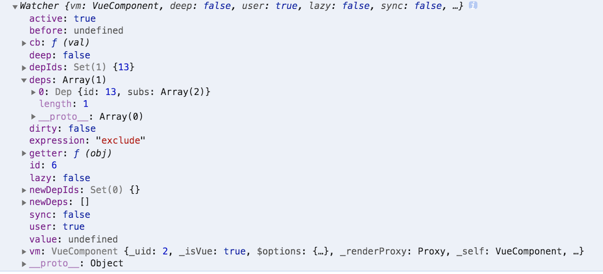

# 流程：
1. 设置Dep.target
2. 取值，触发getter
3. watcher收集进依赖

# $watch
1. 首先需要**在watcher中记录自己都订阅了谁**，也就是watcher实例被收进了那些dep里



2. 然后当watcher不想订阅了以后，循环自己的dep列表，遍历通知他们

# Watche.prototype.addDep方法：
记录在watcher中记录自己都订阅过那些dep

# Watcher里的deps列表存放的是当watcher触发以后需要通知的依赖列表

# Dep的depend和Watcher的addDep:
```js
Dep.prototype.depend = function depend () {
  if (Dep.target) {
    Dep.target.addDep(this);
  }
};

/**
 * Add a dependency to this directive.
 */
Watcher.prototype.addDep = function addDep (dep) {
  var id = dep.id;
  if (!this.newDepIds.has(id)) {  // 如果dep.id重复，则不重复订阅
    this.newDepIds.add(id);   // 记录当前watcher已经订阅了这个dep
    this.newDeps.push(dep);
    if (!this.depIds.has(id)) {  // 如果之前没添加过这个dep
      dep.addSub(this);     // 则让dep的subs列表加入这个watcher
    }
  }
};

```

# 关于Dep：
1. 每new一个dep实例就有一个id
```js
var uid = 0;
/**
 * A dep is an observable that can have multiple
 * directives subscribing to it.
 */
var Dep = function Dep () {
  this.id = uid++;  // 添加的是数据的dep依赖
  this.subs = [];
};
Dep.prototype.addSub = function addSub (sub) {
  this.subs.push(sub);  // 在watcher实例的addDep内
};
```
