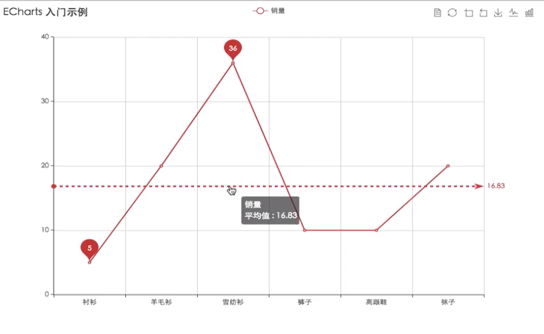

# 配置项：
## 数据项 series：
### 需要参数：
1. name
2. type
3. data

## 图例 legend：

## 标题组件 title
### 配置项：
```js
var option = {
    title:{
        show:true,
        text:'',
        subtext:'',
        textStyle:'',   // 字体样式
        left:150,  // 距离左边的像素值，也可以是 center left right
        borderColor:'red', // 标题边框颜色
        borderWidth:5  // 标题边框宽度
    }
}
```

## x轴 xAxis

## 工具栏 toolbox
### 配置项：
```js
var option = {
    toolbox:{
        show:true,
        feature:{   // 具体显示的功能
            dataView:{  // 可查看并修改数据表
                show:true
            },
            restore:{  // 恢复数据
                show:true
            },
            dataZoom:{  // 区域缩放
                show:true
            },
            saveAsImage:{},
            magicType:{  // 切换图标类型
                type:['line','bar']
            }
        },  
         
    }
}
```

## 信息弹窗 tooltip:
### 配置项：
```js
var option ={
    show:true,
    tooltip:{
        trigger:'item' //数据项触发还是坐标轴触发
    },

}
```

## series下的 标记线和标记点 markline

### 配置项：
总之：通过type（已限定值）指定
```js
var option = {
    series:[{
            markpoint :{
                data:[
                    {type:'max',name:'最大值'}
                    {type:'min',name:'最小值',symbol:'arrow'}
                    ]
            },
            markLine:{
                data:[
                    {type:'average',name:'最大值'}
                    ]
            }
    }]
}
```