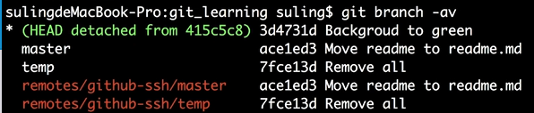

# 分离头指针

## 前述:
HEAD不仅仅可以指向一个分支,也可以指向一个commit
## 何为分离头指针?
如果checkout到一个commit上,这个时候后续的所有操作并未和分支/tag挂钩,此时HEAD不会指向任何一个分支,而是指向这个commit.

## 表现:


## 导致结果:
1. 如果切换到分支上,git会报错,并且提示是否想把这个commit单独建立一个分支

2. 如果切换到分支上,无视报错,就会丢掉这个单独detached的commit修改

## 解决方案:
新建一个分支,绑定这次分离头指针的commit
```css
git branch fix_css < 这里是这次支出去commit 的哈希值 >
```