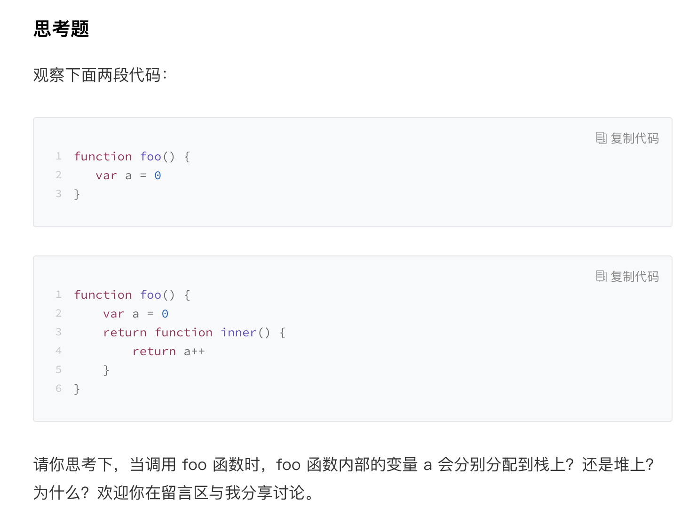

# 闭包

## 一、引擎如何解析：
所有主流的 JavaScript 虚拟机都实现了惰性解析。所谓惰性解析是指解析器在解析的过程中，如果遇到函数声明，那么会跳过函数内部的代码，并不会为其生成 AST 和字节码，而仅仅生成顶层代码的 AST 和字节码。

## 解析流程：
当把这段代码交给 V8 处理时，V8 会至上而下解析这段代码，V8 会为它们生成抽象语法树。在解析过程中首先会遇到 foo 函数，由于这只是一个函数声明语句，V8 在这个阶段只需要将该函数转换为函数对象（**这里只是将该函数声明转换为函数对象，但是并没有解析和编译函数内部的代码，所以也不会为 foo 函数的内部代码生成抽象语法树。**）

## 惰性解析：
V8 解析核心原理：惰性解析  

代码解析完成之后，V8 便会按照顺序自上而下执行代码，首先会先执行“a=1”和“c=4”这两个赋值表达式，接下来执行 foo 函数的调用，过程是从 foo 函数对象中取出函数代码，然后和编译顶层代码一样，V8 会先编译 foo 函数的代码，编译时同样需要先将其编译为抽象语法树和字节码，然后再解释执行。

除了能提升 JavaScript 启动速度，还可以解决部分内存占用的问题

> 引擎在解析阶段只会解析顶层代码，函数会被存为对象
> 在执行阶段遇到函数会把函数内容当成顶层代码解析，再有函数声明再存入堆

## 闭包：
关键词：预解析器，当解析顶层代码的时候，遇到了一个函数，那么预解析器并不会直接跳过该函数，而是**对该函数做一次快速的预解析**，检查函数内部是否引用了外部变量，如果引用了外部的变量，预解析器会将**栈中的变量复制到堆中**，在下次执行到该函数的时候，**直接使用堆中的引用**

# 补：
词法作用域和词法作用域链，每个函数有自己的词法作用域，该函数中定义的变量都存在于该作用域中，然后 V8 会将这些作用域按照词法的位置，也就是代码位置关系，将这些作用域串成一个链，这就是词法作用域链，查找变量的时候会沿着词法作用域链的途径来查找。

# 补2：
入栈的是函数执行上下文

