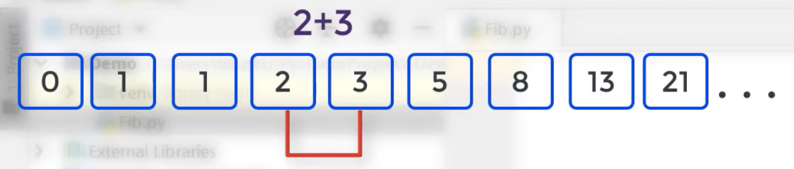

# 时间复杂度：

## 大 O 表示法：

### 常见的时间复杂度：

1. O(1):Constant Complexity 常数复杂度
2. O(log n): Logarithmic Complexity 对数复杂度（二分查找）
3. O(n): Linear Complexity 线性时间复杂度（回答每个节点仅访问一次：二叉树遍历，图的遍历，搜索算法DFS、CFS）
4. O(n^2): N square Complexity 平方
5. O(n^3): N square Complexity 立方
6. O(2^n): Exponential Growth 指数
7. O(n!): Factorial 阶乘

## 如何判断时间复杂度？

1. 执行次数
   1. 没有循环：常数复杂度（只说 O(1)）
   2. 循环一次：O(n)
   3. 嵌套循环: O(n^2) / O(n^3)
   4. 执行次数永远是 log n（开根号），会很快
   5. 递归：O(k^n):指数级（斐波那契）
2. 递归如何分析？

   1. 画出递归树

   ```js
   ```

   2. 通过主定理计算递归时间复杂度：
      1. 二分查找（O(log n)）
      2. 二叉树遍历 (O(n))，只访问一个节点一次
      3. 二维数组二分查找(O(n))
      4. 归并排序

## 要做到：

日常开发要下意识分析自己代码时间空间复杂度

## 斐波那契数列：


解释：当前值是前两个值的和:`F(n) = F(n-1) + F(n-2)`
